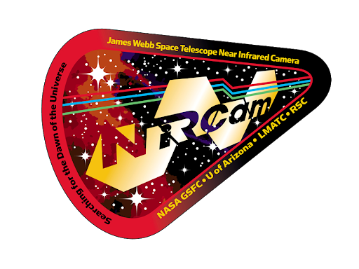

# NIRCam AZ TSO Data Challenge

 

## Description

***GOALS:***

The goal of this activity is to simulate TSOs for an exoplanet much like GJ 436b using MIRAGE for the JWST/NIRCam UArizona TSO Data Challenge using both long-wave (LW) grism observations as well as short-wave (SW) simultaneous photometry with a weak lens.

***TARGET:***

The planet for the simulated observations is loosely based on GJ 436b. The transit parameters are listed below, with their associated uncertainties. 

**Note!** The actual parameters used to generate the simulated lightcurves have been randomly drawn from the values listed below using a Gaussian with a standard deviation equal to the associated uncertainty. As an example, a/Rs was chosen using the Python command scipy.norm.rvs(loc=14.54, scale=0.14). So don't just fix everything to the central values and assume it will work.

The stellar properties are:
* **Teff:** 3500K
* **log(g):** 5.0
* **[Fe/H]:** 0.0

Limb-darkening is included, but is assumed to be constant as a function of wavelength. The exact LD coefficients are left as an exercise for the observer.

|           Parameter          	|      Value     	|  Uncertainty  	|
|:----------------------------:	|:--------------:	|:-------------:	|
| Transit Center Time (GRISMC) 	| 2459491.323591 	|  +/-0.000035  	|
| Transit Center Time (GRISMR) 	| 2459560.576056 	|  +/-0.000035  	|
|            Period            	|   2.64389803   	| +/-0.00000026 	|
|             Rp/Rs            	|     0.0822     	|    +/-0.001   	|
|             a/Rs             	|      14.54     	|    +/-0.14    	|
|          Inclination         	|     86.858     	|    +/-0.052   	|

## Expectations:

These images were created using the MIRAGE simulator in NIRCam's GRISMR and GRISMC configuration. GRISMR disperses the spectra horizontally on the detector, along the detector rows. This is the default for time-series observations with NIRCam. GRISMC disperses the spectra vertically on the detector, along the detector columns. This is a possible alternate configuration for time-series observations with NIRCam that is not currently implemented. We expect that GRISMR will show more 1/f noise than GRISMC and GRISMC will show less 1/f noise than GRISMR (Schlawin et al. 2020). This 1/f noise is caused by uncorrected, correlated, read noise on the detector that occurs along detector rows.

***AUTHOR:***
* Arsh Nadkarni (UArizona): arshn2000@email.arizona.edu
